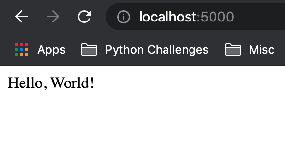

# Introduction to Flask
**Flask** is a Python web framework designed to help with creating web applications.

We will be using **Flask** to create our web applications.

As Flask is not part of the Python standard library (it doesn't come with Python itself) we need to install it first.

We can do this using **pip** which is the Python package manager.

```
pip install Flask
```
For this command to work successfully we need an internet connection as ***pip*** will go and retrieve the ***Flask*** package from **PyPi - The Python Package Index.**

**PyPi** is like an online hub that stores all packages we might install with pip.

An example of the output we would expect  below:
```
Collecting Flask
  Using cached Flask-2.0.2-py3-none-any.whl (95 kB)
Collecting itsdangerous>=2.0
  Using cached itsdangerous-2.0.1-py3-none-any.whl (18 kB)
Collecting Werkzeug>=2.0
  Using cached Werkzeug-2.0.2-py3-none-any.whl (288 kB)
Collecting click>=7.1.2
  Using cached click-8.0.3-py3-none-any.whl (97 kB)
Collecting Jinja2>=3.0
  Using cached Jinja2-3.0.3-py3-none-any.whl (133 kB)
Collecting importlib-metadata
  Downloading importlib_metadata-4.10.0-py3-none-any.whl (17 kB)
Collecting MarkupSafe>=2.0
  Using cached MarkupSafe-2.0.1-cp37-cp37m-macosx_10_9_x86_64.whl (13 kB)
Collecting typing-extensions>=3.6.4
  Downloading typing_extensions-4.0.1-py3-none-any.whl (22 kB)
Collecting zipp>=0.5
  Downloading zipp-3.7.0-py3-none-any.whl (5.3 kB)
Installing collected packages: zipp, typing-extensions, MarkupSafe, importlib-metadata, Werkzeug, Jinja2, itsdangerous, click, Flask
Successfully installed Flask-2.0.2 Jinja2-3.0.3 MarkupSafe-2.0.1 Werkzeug-2.0.2 click-8.0.3 importlib-metadata-4.10.0 itsdangerous-2.0.1 typing-extensions-4.0.1 zipp-3.7.0
```
To check if installation has been completed successfully:

Launch interpreter:

```
$ python
```
```
>>> from flask import Flask
>>> help(Flask)
```

Result should be:
```
Help on class Flask in module flask.app:
...
```

quickstart_example.py

```
from flask import Flask

app = Flask(__name__)

@app.route("/")
def hello_world():
    return "<p>Hello, World!</p>"

if __name__ == "__main__":
    app.run(debug=True)
```
Output in terminal should be like below:

```
* Serving Flask app 'quickstart_example' (lazy loading)
 * Environment: production
   WARNING: This is a development server. Do not use it in a production deployment.
   Use a production WSGI server instead.
 * Debug mode: on
 * Running on http://127.0.0.1:5000/ (Press CTRL+C to quit)
 * Restarting with stat
 * Debugger is active!
 * Debugger PIN: 116-201-697
 ```
Note the line:
```
 * Running on http://127.0.0.1:5000/ (Press CTRL+C to quit)
 ```
 This is telling us the application is available at this address (localhost:5000).

 Go to a browser and enter:
 ```
 localhost:5000
 ```
You should get something like this:



If another program is already using port 5000, you’ll see OSError: [Errno 98] or OSError: [WinError 10013] when the server tries to start. In this case the easiest solution is to change the port to another port number.

Example:
```
from flask import Flask

app = Flask(__name__)

@app.route("/")
def hello_world():
    return "<p>Hello, World!</p>"

if __name__ == "__main__":
    app.run(debug=True, port=8080)
```

Then access at the create port:
```
localhost:8080
```
To stop the web server running, go to the terminal and type command ***Ctrl+C***.